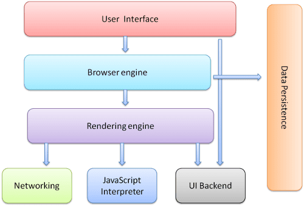

# 浏览器解析原理

## 1.浏览器整体结构

- **界面**：包括地址栏、前进/后退按钮、书签菜单等。界面上除了显示所请求的网页的窗口外，它还会包括浏览器界面的各个部分。
- **浏览器引擎**：在界面和呈现引擎之间编组操作。
- **渲染引擎**：负责显示请求的内容。例如，如果请求的内容是 HTML，呈现引擎会解析 HTML 和 CSS，并在屏幕上显示解析后的内容。 
- **网络**：对于 HTTP 请求等网络调用，针对位于平台独立接口后面的不同平台使用不同的实现。
- **界面后端**：用于绘制基本 widget，如组合框和窗口。此后端公开了与平台无关的通用接口。在底层使用操作系统界面方法。
- **JavaScript 解释器**。用于解析和执行 JavaScript 代码。
- **数据存储**。这是一个持久性层。浏览器可能需要在本地保存各种数据，例如 Cookie。浏览器还支持 localStorage、IndexedDB、WebSQL 和 FileSystem 等存储机制。

## 2.主流程

### 渲染引擎
渲染引擎负责渲染...渲染，也就是在浏览器屏幕上显示请求的内容。

默认情况下，渲染引擎可显示 HTML 和 XML 文档及图片。

### 主流程展示
渲染引擎将开始从网络层获取所请求文档的内容。此操作通常以 8 kB 数据块的形式完成。

之后，以下是渲染引擎的基本流程：

**渲染是一个渐进的过程，为了用户更好的体验，渲染引擎不必等待全部html内容解析完毕后，就会开始构建呈现树和设置布局**

webkit主流程示例：
