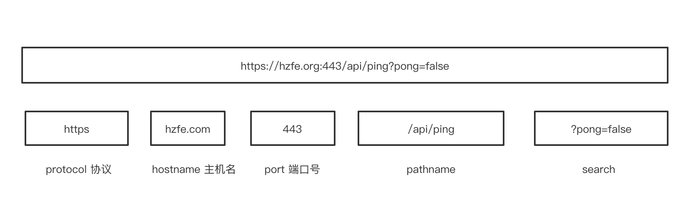
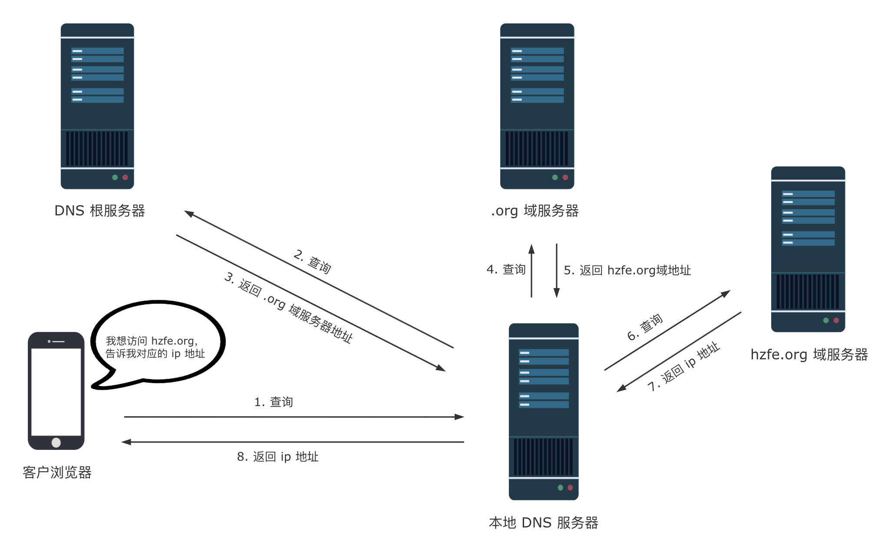

# 浏览器从输入网址到页面展示的过程

## 关键点
- URL 输入
- DNS 解析
- 建立 TCP 连接
- 发送 HTTP / HTTPS 请求（建立 TLS 连 接）
- 服务器响应请求
- 浏览器解析渲染页面
- HTTP 请求结束，断开 TCP 连接

## 1. URL 输入

输入并按下回车后，浏览器会
- 检查输入的内容是否是一个合法的 URL 链接。
- 是，则判断输入的 URL 是否完整。如果不完整，浏览器可能会对域进行猜测，补全前缀或者后缀。
- 否，将输入内容作为搜索条件，使用用户设置的默认搜索引擎来进行搜索。

## 2. DNS解析

1. 操作系统检查浏览器缓存和本地的 hosts 文件中，是否有这个网址记录，有则从记录里面找到对应的 IP 地址，完成域名解析。
2. 查找本地 DNS 解析器缓存中，是否有这个网址记录，有则从记录里面找到对应的 IP 地址，完成域名解析。
3. 使用 TCP/IP 参数中设置的 DNS 服务器进行查询。如果要查询的域名包含在本地配置区域资源中，则返回解析结果，完成域名解析。
4. 检查本地 DNS 服务器是否缓存该网址记录，有则返回解析结果，完成域名解析。
5. 本地 DNS 服务器发送查询报文至根 DNS 服务器，根 DNS 服务器收到请求后，用顶级域 DNS 服务器地址进行响应。
6. 本地 DNS 服务器发送查询报文至顶级域 DNS 服务器。顶级域 DNS 服务器收到请求后，用权威 DNS 服务器地址进行响应。
7. 本地 DNS 服务器发送查询报文至权威 DNS 服务器，权威 DNS 服务器收到请求后，用 目标网站的 IP 地址进行响应，完成域名解析。