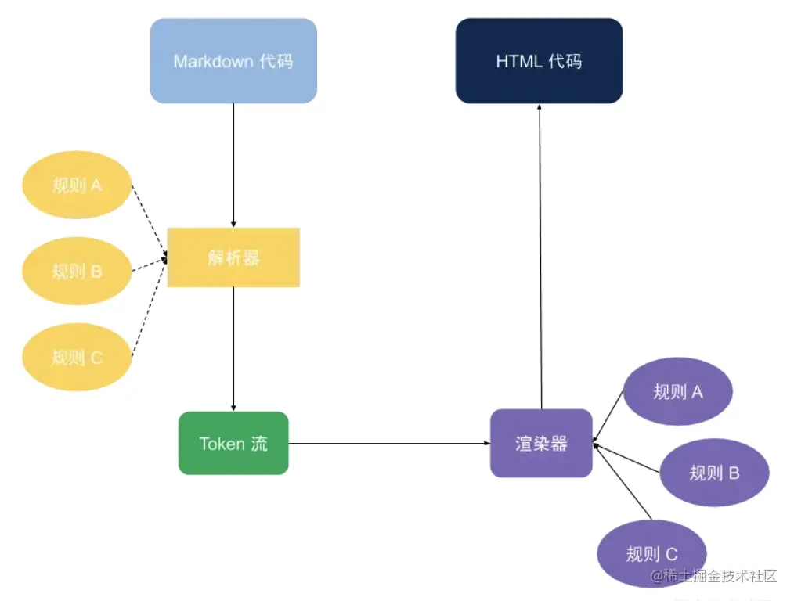

# 如何实现markdown和html文件互相转换


## html转markdown

## markdown转html
转换规则：


### 解析md文件为token流

我们会先使用js来读取整个js文件，将其整合为一个字符串，然后读取并解析这个字符串，生成对应的token。

那么这个token的类型有哪些？

```ts
type Toke {
  interface Space: {
    ···
  },
  interface Tag: {
    ···
    // 通过rules转换为相关的html标签
  },
  interface Table: {
    ···
  },
  interface List: {

  },
  interface ListItems: {

  }
  ...
}
```

那么要做的就是写一个函数把目标字符串转换为相关的token流


### 将token流渲染为html文件

## html转markdown

这里使用了一个包**turndown**，具体使用方法如下：
```js
var TurndownService = require('turndown')

var turndownService = new TurndownService()
var markdown = turndownService.turndown('<h1>Hello world!</h1>')
```

页面加载进入时，在整个网页进行监听
```js
body.addEventListener('mousedown', ()=>{})

body.addEventListener('mouseup', () => {})
```

在mouseup和mousedown中使用window.getSelection获取当前所选取的内容和类型，并调用trundown函数，将其转换为html

页面离开时，使用removeEventlistener取消事件监听
```js
removeEventListener(type, listener, options);
```