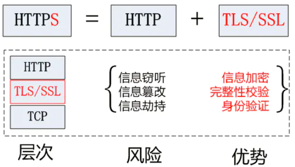
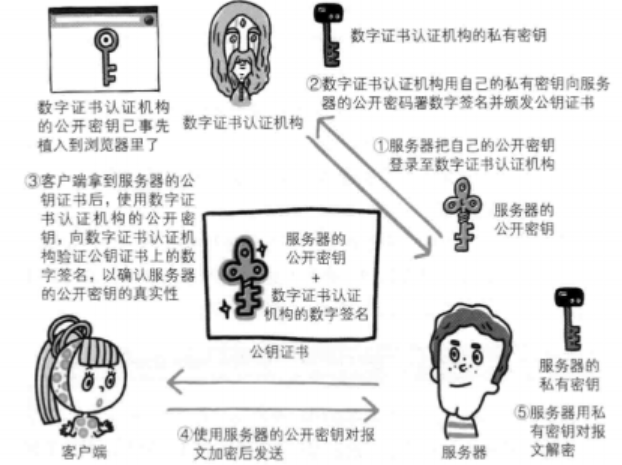

# HTTP与HTTPS

## http与https的关系

## Https是如何保证安全的
依靠SSL来保证安全的

SSL的实现这些功能主要依赖于三种手段：

- 对称加密：采用协商的密钥对数据加密
- 非对称加密：实现身份认证和密钥协商
- 摘要算法：验证信息的完整性
- 数字签名：身份验证

## SSL(Secure Sockets Layer 安全套接字协议)的实现
主要依靠三种手段
- 加密：对称加密，非对称加密
- 摘要算法：验证信息完整性
- 数字签名：身份验证

## 对称加密和非对称加密
- **对称加密：**加密和解密使用的密钥都是同一个，是对称的。
- **非对称加密：**存在两个秘钥，一个叫公钥，一个叫私钥。
公钥和私钥都可以用来加密解密，但公钥加密后只能用私钥解 密，反过来，私钥加密后也只能用公钥解密
- **混合加密**：**在HTTPS通信**过程中，采用的是对称加密+非对称加密，也就是混合加密，https采用的就是混合加密

HTTPS采用非对称加密解决秘钥交换的问题(即混合加密)

具体做法是发送密文的一方使用对方的公钥进行加密处理“对称的密钥”，然后对方用自己的私钥解密拿到“对称的密钥”

## 摘要算法

一种特殊的压缩算法，它能够把任意长度的数据“压缩”成固定长度、而且独一无二的“摘要”字符串，就好像是给这段数据生成了一个数字“指纹”

这保证了https传输过程中的完整性

## 数字签名

数字签名能确定消息确实是由发送方签名并发出来的，因为别人假冒不了发送方的签名

原理其实很简单，就是用私钥加密，公钥解密

签名和公钥一样完全公开，任何人都可以获取。但这个签名只有用私钥对应的公钥才能解开，拿到摘要后，再比对原文验证完整性，就可以像签署文件一样证明消息确实是你发的

和消息本身一样，因为谁都可以发布公钥，我们还缺少防止黑客伪造公钥的手段，也就是说，怎么判断这个公钥就是你的公钥

这时候就需要一个第三方，就是证书验证机构

## 证书验证机构
CA 对公钥的签名认证要求包括序列号、用途、颁发者、有效时间等等，把这些打成一个包再签名，完整地证明公钥关联的各种信息，形成“数字证书”

流程如下图：
