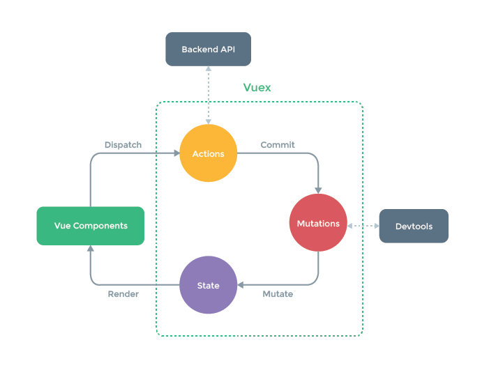

# Vue组件间通信

## 通过props传递
适用场景：父组件传递数据给子组件
子组件设置props属性，定义接收父组件传递过来的参数
父组件在使用子组件标签中通过字面量来传递值
## 通过$emit触发事件
适用场景：子组件传递数据给父组件
子组件通过$emit触发自定义事件，$emit第二个参数为传递的数值
父组件绑定监听器获取到子组件传递过来的参数
```js
// Chilfen.vue

this.$emit('add', good)  
// Father.vue

<Children @add="cartAdd($event)" /> 
```
## 使用ref
父组件在使用子组件的时候设置ref
父组件通过设置子组件ref来获取数据
```js
父组件

<Children ref="foo" />  
  
this.$refs.foo  
// 获取子组件实例，通过子组件实例我们就能拿到对应的数据  
```
## Vuex
适用场景: 复杂关系的组件数据传递

Vuex作用相当于一个用来存储共享变量的容器
- state用来存放共享变量的地方
- getter，可以增加一个getter派生状态，(相当于store中的计算属性)，用来获得共享变量的值
- mutations用来存放修改state的方法。
- actions也是用来存放修改state的方法，不过action是在mutations的基础上进行。常用来做一些异步操作

## 透传props(依赖注入)
provide 和 inject 可以帮助我们解决这一问题。 一个父组件相对于其所有的后代组件，会作为依赖提供者。任何后代的组件树，无论层级有多深，都可以注入由父组件提供给整条链路的依赖。


### Provide (提供)
为后代提供数据
```js
<script setup>
import { provide } from 'vue'

provide(/* 注入名 */ 'message', /* 值 */ 'hello!')
</script>
```
provide() 函数接收两个参数。

第一个参数被称为注入名，可以是一个字符串或是一个 Symbol。后代组件会用注入名来查找期望注入的值。一个组件可以多次调用 provide()，使用不同的注入名，注入不同的依赖值。

第二个参数是提供的值，值可以是任意类型，包括响应式的状态

### Inject (注入)
```js
<script setup>
import { inject } from 'vue'

const message = inject('message')
</script>
```